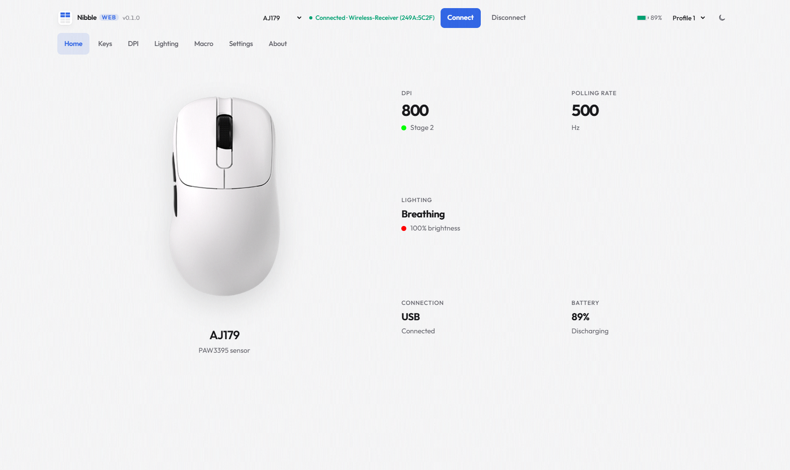

# Nibble

<p>
  <a href="https://nibble.app.qafqazsiradaglari.xyz"><strong>Launch Web App ⚡</strong></a> ·
  <a href="https://nibble.qafqazsiradaglari.xyz"><strong>Website</strong></a> ·
  <a href="https://github.com/mahammadismayilov/nibble/releases"><strong>Releases</strong></a> ·
  <a href="https://nibble.qafqazsiradaglari.xyz/#pricing"><strong>Support</strong></a>
</p>

Browser-based WebHID mouse configurator for PAW3395 & PAW3950 wireless gaming mice.  
Configure DPI, 8K polling rate, lighting, keys, and power — no Windows installer, no OEM bloat.

---



## Quick start

### 🌐 Web App (No Install)

Open **[nibble.app.qafqazsiradaglari.xyz](https://nibble.app.qafqazsiradaglari.xyz)** in **Chrome** or **Edge** — WebHID talks to your mouse receiver directly in browser!

**You need Chrome or Edge** — WebHID doesn't work in Firefox or Safari.

### Windows

Double-click `start.bat` or run:

```bash
python -m http.server 8080
```

### macOS / Linux

```bash
chmod +x start.sh
./start.sh
# or: python3 -m http.server 8080
```

Then open **http://localhost:8080** in Chrome or Edge.

### First connection

1. Close any OEM mouse software (AJAZZ, etc.)
2. Plug in your wireless receiver
3. Click **Connect** in Nibble
4. Pick **Wireless-Receiver / config** (not mouse/keyboard)

## Download

[Download the latest release](https://github.com/mahammadismayilov/nibble/releases) — extract anywhere, no install.

Or clone:

```bash
git clone https://github.com/mahammadismayilov/nibble.git
```

## Supported devices

| Model | Sensor | Max DPI | Max Polling Rate | Receiver / Hardware IDs | Status |
| :--- | :--- | :--- | :--- | :--- | :--- |
| **AJAZZ AJ179 / AJ179P** | PAW3395 | 26,000 DPI | 1000 Hz | CompX (`VID_248A` / `249A`) | Verified Working |
| **AJAZZ AJ179 APEX** | PAW3950 APEX | 30,000 DPI | 8000 Hz (8K) | Yichip (`VID_3151` · `PID_5007` / `502D`) | Protocol Supported |
| **AJAZZ AJ159 APEX** | PAW3950 APEX | 30,000 DPI | 8000 Hz (8K) | Yichip (`VID_3151` · `PID_5007` / `502D`) | Community Test Pending |
| **AJAZZ AJ159 PRO** | PAW3395 | 26,000 DPI | 8000 Hz (8K) | Yichip (`VID_3151` · `PID_402D` / `4026`) | Community Test Pending |
| **AJAZZ AJ159 / AJ159P / MC** | PAW3395 | 26,000 DPI | 1000 Hz | CompX (`VID_248A` / `249A`) | Protocol Supported |
| **AJAZZ AJ139 Pro** | PAW3395 | 26,000 DPI | 1000 Hz | CompX (`VID_248A` / `249A`) | Protocol Supported |

> View the live [Supported Devices Catalog](https://nibble.qafqazsiradaglari.xyz/devices.html) for full specs and test status.

## Why a local server?

WebHID requires a secure context (HTTPS or localhost). You can't just open `index.html` from the file system — you need a local HTTP server. The scripts above handle that.

## License

GPL-3.0 — see [LICENSE](./LICENSE).

---

Unofficial community project. Not affiliated with any mouse OEM.  
Protocol derived from **AJAZZ Driver (X) 1.0.1.4** (2024.01.04).